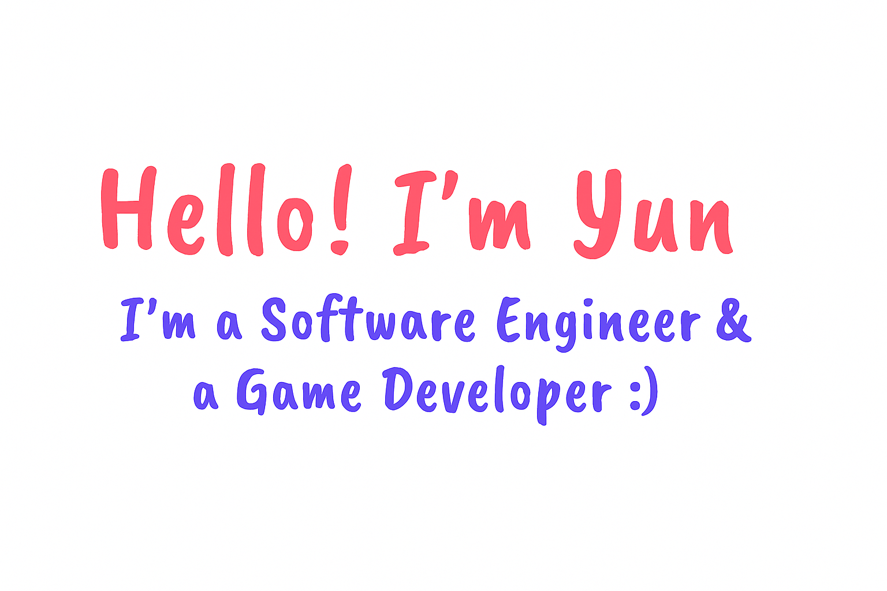

## Hi ! I'm Yun ! ʚ₍ᐢ. .ᐢ₎ɞ
### 안녕하세요, 저는 윤이에요.

- Lover of Kim Dokja (가장오래된꿈）
- Game Developer
- Fullstack developer

### 🏗️ Learning:

<code></code>
<code></code>
<code></code>
<code></code>
<code></code>

### 📫 Reach me:

- **Discord** : @scalaadcaelum
- **E-mail** : scalaadcoelum@gmail.com

> ### Hi, I am currently looking for a new job opportunity. I have more than five years of work experience. my contact info is above. Feel free to contact me at any time !

### 🏠 Blog:

- ****

### 📈 Activity Graph:

  
